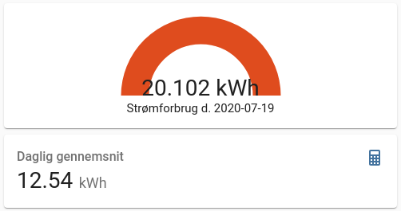

# eloverblik

[](https://github.com/hacs/integration)

The `eloverblik`component is a Home Assistant custom component for monitoring your electricity data from eloverblik.dk

*The custom component in it's very early stage for showing data from eloverblik.dk.*

## Installation

### Manual Installation

  1. Copy eloverblik folder into your custom_components folder in your hass configuration directory.
  2. Restart Home Assistant.
  3. Configure Eloverblik through Configuration -> Integrations -> Add Integration.

### Installation with HACS (Home Assistant Community Store)

  1. Ensure that [HACS](https://hacs.xyz/) is installed.
  2. Search for and install the `eloverblik` integration through HACS.
  3. Restart Home Assistant. 
  4. Configure Eloverblik through Configuration -> Integrations -> Add Integration.


## Configuration

### Refresh token and metering point

Get refresh token and metering point from https://eloverblik.dk.

  1. Login at [eloverblik](https://eloverblik.dk).
  2. metering point is your `ID`
  3. refresh token can be created by clicking at you user and chose share data.

## State and attributes
---
A sensor for each over hour in the past 24 hours is created with the syntax:
 * sensor.eloverblik_energy_0_1
 * sensor.eloverblik_energy_1_2
 * etc.

A sensor which sum up the total energy usage is added as well:
 * sensor.eloverblik_energy_total

All sensors show their value in kWh.

## Debugging
It is possible to debug log the raw response from eloverblik.dk API. This is done by setting up logging like below in configuration.yaml in Home Assistant. It is also possible to set the log level through a service call in UI.  
```
logger: 
  default: info
  logs: 
    pyeloverblik.eloverblik: debug
```

## Examples

### Daily average and gauge bar indicating high usage
Below example is an example how to display daily average and a guage indicating high usage. 




**Requirements**

* Recorder component holding minimum the number of days the average display should cover.
* Lovelace Config Template Card (https://github.com/iantrich/config-template-card)

**Average sensor**

Below statistics sensor shows the daily average calculated over the last 30 days. 
```
sensor:
  - platform: statistics
    entity_id: sensor.eloverblik_energy_total
    name: Eloverblik Monthly Statistics
    sampling_size: 50
    max_age:
        days: 30

```

**Lovelace**

```
type: vertical-stack
cards:
  - card:
      entity: sensor.eloverblik_energy_total
      max: 20
      min: 0
      name: >-
        ${'Strømforbrug d. ' +
        states['sensor.eloverblik_energy_total'].attributes.metering_date }
      severity:
        green: 0
        red: '${states[''sensor.eloverblik_monthly_statistics''].state * 1.25}'
        yellow: '${states[''sensor.eloverblik_monthly_statistics''].state * 1.10}'
      type: gauge
    entities:
      - sensor.eloverblik_energy_total
      - sensor.eloverblik_monthly_statistics
    type: 'custom:config-template-card'
  - type: entity
    entity: sensor.eloverblik_monthly_statistics
    name: Daglig gennemsnit

```

### Long term statistics / Energy dashboard

The sensors does not support long term statistics or the energy dashboard out the box. The reason for this is that only sensors with measurements in present time should support this. This is described in official Home Assistant guide lines on [https://developers.home-assistant.io/docs/core/entity/sensor/#long-term-statistics](https://developers.home-assistant.io/docs/core/entity/sensor/#long-term-statistics).  Eloverblik sensor data is at least one or two days old and that can not be changed as this is what is delivered from eloverblik.dk. What would happen, if this was supported, is that statistics card or energy dashboard will show the data on the wrong date and most likely also show wrong data.

If you insist on adding support for long term statistics you can create a template sensor like below. **You have been warned about data showing up on the wrong date and most likely the amount will also be wrong.**
```
template: 
  - sensor: 
    - name: "Eloverblik Long Term Statistics"
      unit_of_measurement: kWh
      state: "{{ states('sensor.eloverblik_energy_total') }}"
      attributes: 
        device_class: energy
        state_class: measurement
        last_reset: "{{ state_attr('sensor.eloverblik_energy_total', 'metering_date') }}"
```

### Forecast total kWh price with Nordpool integration

If you have the [Nordpool](https://github.com/custom-components/nordpool) installed you can calculate the current electricity price and forecast the price for today and tomorrow by the hour. These prices will including any tarrifs that apply, which will adjust according to peak times and season as they are fetched from Eloverblik. This way you will get the actual price you pay per kWh. You can plot this on a dashboard, or use it in the Energy dashboard.

To combine the the nordpool and eloverblik sensors, create the following template sensor:

```
template:
  - sensor:
    - name: "Electricity Cost"
      unique_id: electricity_cost
      device_class: monetary
      unit_of_measurement: "kr/kWh"
      state: >
        {{ float(states('sensor.eloverblik_tariff_sum')) + float(states('sensor.nordpool')) }}
      attributes:
        today: >
          
            
            
              
            
            {{ ns.prices }}
          
        tomorrow: >
          
            
            
              
            
            {{ ns.prices }}
          
```

Replace `nordpool` with the name of your Nordpool sensor.