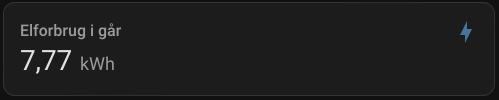
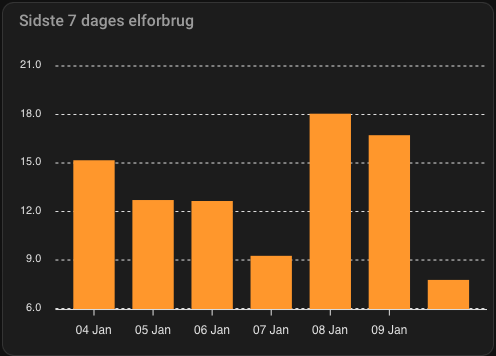

# eloverblik

[](https://github.com/hacs/integration)

The `eloverblik` component is a Home Assistant custom component for monitoring your electricity data from [eloverblik.dk](https://eloverblik.dk).

** Important information **
I no longer actively develop this component. There are mainly two reasons for that. 
1. Eloverblik API is know for being unstable and slow. There is nothing I can do about that.
2. I no longer actively use this integration my self.

PR's are still welcome and will get reviewed and merged!

## Installation

### Manual installation

  1. Copy `eloverblik` folder into your `custom_components` folder in your HASS configuration directory.
  2. Restart Home Assistant (Settings → ⋮ (the top-right 3-dot menu) → Restart Home Assistant → Restart Home Assistant → Restart).
  3. [Configure](#configuration) Eloverblik through Settings → Devices & Services → Add Integration.
     * Or use this shortcut  
     [](https://my.home-assistant.io/redirect/config_flow_start/?domain=eloverblik)

### Installation with HACS (Home Assistant Community Store)

  1. Ensure that [HACS](https://hacs.xyz/) is installed.
  2. Search for and install the `eloverblik` integration through HACS.
     * Or use this shortcut  
     [](https://my.home-assistant.io/redirect/hacs_repository/?owner=JonasPed&repository=homeassistant-eloverblik&category=integration)
  3. Restart Home Assistant (Settings → ⋮ (the top-right 3-dot menu) → Restart Home Assistant → Restart Home Assistant → Restart).
  4. [Configure](#configuration) Eloverblik through Settings → Devices & Services → Add Integration.
     * Or use this shortcut  
     [](https://my.home-assistant.io/redirect/config_flow_start/?domain=eloverblik)

## Configuration

### Refresh token and metering point

Get the refresh token and the metering point from [eloverblik.dk](https://eloverblik.dk/customer/).

  1. Log in to [Eloverblik](https://eloverblik.dk/customer/overview/).
  2. Metering point ID is used for `ID` in Home Assistant.
  3. Create a refresh token.
     1. Click your user.
     2. Chose **Data Sharing**.
     3. Click **Create token** and go trough the steps setting your preferences.

## State and attributes
---
A sensor for each over hour in the past 24 hours is created with the syntax:
 * `sensor.eloverblik_energy_0_1`
 * `sensor.eloverblik_energy_1_2`
 * etc.

A sensor which sum up the total energy usage is added as well:
 * `sensor.eloverblik_energy_total`

All sensors show their value in kWh.

## Debugging
It is possible to debug log the raw response from eloverblik.dk API. This is done by setting up logging like below in configuration.yaml in Home Assistant. It is also possible to set the log level through a service call in UI.  
```yaml
logger: 
  default: info
  logs: 
    pyeloverblik.eloverblik: debug
```

## Examples

### Daily average and gauge bar indicating high usage
Below example is an example how to display daily average and a guage indicating high usage. 


**Requirements**

* Recorder component holding minimum the number of days the average display should cover.
* Lovelace Config Template Card (https://github.com/iantrich/config-template-card)

**Average sensor**

Below statistics sensor shows the daily average calculated over the last 30 days. 
```yaml
sensor:
  - platform: statistics
    entity_id: sensor.eloverblik_energy_total
    name: Eloverblik Monthly Statistics
    sampling_size: 50
    state_characteristic: mean
    max_age:
        days: 30

```

**Lovelace**

```yaml
type: vertical-stack
cards:
  - card:
      entity: sensor.eloverblik_energy_total
      max: 20
      min: 0
      name: >-
        ${'Strømforbrug d. ' +
        states['sensor.eloverblik_energy_total'].attributes.metering_date }
      severity:
        green: 0
        red: '${states[''sensor.eloverblik_monthly_statistics''].state * 1.25}'
        yellow: '${states[''sensor.eloverblik_monthly_statistics''].state * 1.10}'
      type: gauge
    entities:
      - sensor.eloverblik_energy_total
      - sensor.eloverblik_monthly_statistics
    type: 'custom:config-template-card'
  - type: entity
    entity: sensor.eloverblik_monthly_statistics
    name: Daglig gennemsnit

```

### Forecast total kWh price with Nordpool integration

If you have the [Nordpool](https://github.com/custom-components/nordpool) installed you can calculate the current electricity price and forecast the price for today and tomorrow by the hour. These prices will including any tarrifs that apply, which will adjust according to peak times and season as they are fetched from Eloverblik. This way you will get the actual price you pay per kWh. You can plot this on a dashboard, or use it in the Energy dashboard.

To combine the the nordpool and eloverblik sensors, create below template sensor. Please note that the template assumes that your nordpool integration is configuerd to NOT include VAT.

```yaml
template:
  - sensor:
    - name: "Electricity Cost"
      unique_id: electricity_cost
      device_class: monetary
      unit_of_measurement: "kr/kWh"
      state: >
        {{ 1.25 * (float(states('sensor.eloverblik_tariff_sum')) + float(states('sensor.nordpool'))) }}
      attributes:
        today: >
          
            
            
              
            
            {{ ns.prices }}
          
        tomorrow: >
          
            
            
              
            
            {{ ns.prices }}
          
```

Replace `nordpool` with the name of your Nordpool sensor.


## Long term statistics and Energy dashboard

The integration **now supports long-term statistics** and energy dashboard.

The integration will pull current and last years data from Eloverblik and insert 
it into the long-term statistics in HomeAssistant.

An entity with the id `sensor.eloverblik_energy_statistic` is created, 
this entity will **always** have an `unknown` value, since if a current value is set, 
the recorder will try to write it to the statistics. 

> **_NOTE:_**  This is not the ideal setup, but it does enable owners that do not have live access to their measurements to get the data into home-assitant.

But the entity will have a valid long-term statistic.

The statistic will continually be updateed daily.

> **_NOTE:_**  The data will be delayed between 1 and 3 days, depending on your local grid operator (DSO).

Below are two examples of UI yaml configuration to display the values.

### Yesterdays consumption example:

```yaml
type: statistic
name: Elforbrug i går
entity: sensor.eloverblik_energy_statistic
period:
  calendar:
    period: day
    offset: -1
stat_type: change
icon: mdi:lightning-bolt
```


#### Last weeks consumption 
This is created with the help of [apexcharts](https://github.com/RomRider/apexcharts-card)
```yaml
type: custom:apexcharts-card
graph_span: 7d
header:
  show: true
  title: Sidste 7 dages elforbrug
span:
  end: day
  offset: '-1d'
series:
  - entity: sensor.eloverblik_energy_statistic
    type: column
    statistics:
      type: sum
      period: hour
    group_by:
      func: diff
      start_with_last: true
      duration: 1d
```

